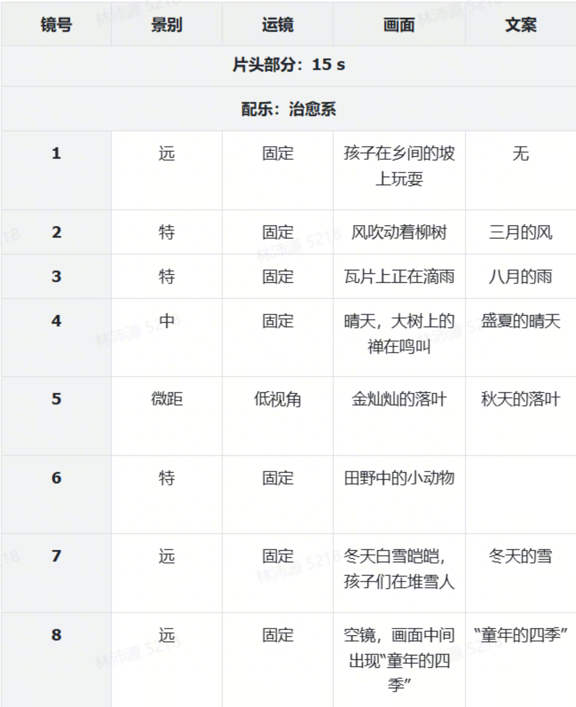

# 🤖 Awesome Seedance 2.0 Prompts

[](https://github.com/sindresorhus/awesome)
[](https://github.com/weshopai/awesome-Seedance-2.0-prompt)
[](https://www.weshop.ai/tools/z-image)

> A collection of prompts for Seedance 2.0

> ⚠️ Copyright Notice: All prompts are collected from the community for educational purposes. If you believe any content infringes on your rights, please open an issue and we will remove it promptly.

## 🤖 Try it in WeShop AI（Coming Soon...)
<div align="center">

  [](https://weshop.ai)
  
</div>

<div align="center">
  
Why use WeShop AI?
  
| Feature | WeShop AI | Others |
|------|-----------|--------|
| ⚙️ Workflow Setup | One-click generation | Manual settup & complecated steps |
| 🧠 Prompt Examples | Rich, ready-to-use prompt templates & cases | Limited or user-created |
| 🚀 Batch Generation | Fast batch generation at scale | Slow or manual batching |
| 🤖 AI Automation | End-to-end AI generation in one place | Fragmented tools |
| 📱 Accessibility | Web-based, efficient, and easy to use | Requires installations or tool-dependent |

</div>

---

## 📖 Table of Contents

- [🤖 Try it in WeShop AI](#-try-it-in-weshop-ai)
- [🤔 What is Seedance 2.0?](#-what-is-seedance-20)
- [✍️ All Prompts](#-all-prompts)
  - [Basic Abilities](#basic-abilities)
  - [Consistency](#consistency)
  - [Percise Camera Movements](#percise-camera-movements)
  - [Creative Effects](#creative-effects)
  - [Storytelling](#storytelling)
  - [Extension](#extension)
  - [Sound](#sound)
  - [Continiuty](#continuity)
  - [Video Edit](#video-edit)
  - [Music](#music)
  - [Emotion](#emotion)
---

Ever since the days when we could only “tell stories” with text and the first/last frames, we’ve wanted to build a video model that truly understands what you’re trying to express.

## 🤔 What is Seedance 2.0

Seedance 2.0 supports four input modalities—image, video, audio, and text—offering richer ways to express yourself and more controllable generation. You can use a single image to set the visual style, a video to specify a character’s actions and camera changes, and a few seconds of audio to establish rhythm and atmosphere… Combined with prompts, the creative process becomes more natural, more efficient, and more like being a real “director.”

• Image reference can accurately reproduce composition and character details  
• With reference video, it supports recreating cinematic language, complex action rhythms, and creative special effects  
• Video supports smooth extension and seamless continuation; it can generate continuous shots based on user prompts—not just generating, but also “keeping the camera rolling”  
• Editing capabilities have also been enhanced, supporting character replacement, deletion, and addition in existing videos

📚 Learn More: [Seedance 2.0 Documentation](https://waytoagi.feishu.cn/wiki/XhA5wVLW8itFYxkCteDcELETnXe)

## 📋 All Prompts

### No.6


```
真人实拍风格，一位美丽的留着黑色波浪长发的少女，穿着粉色露脐装和瑜伽裤要求性感，皮肤白皙，正随着Future House风格的DJ舞曲俏皮地舞动，舞蹈动作包含俏皮的摆胯、手臂波浪步和定点pose，且与音乐节拍完全吻合；镜头会跟着音乐节拍前后推拉运镜，背景是在卧室里面，顶部有柔和的聚光灯打下来照亮少女，整体光影柔和、氛围感强，画面比例为9:16。排除：模糊，低清，噪点，水印，文字，logo，扭曲，变形，五官崩坏，动作僵硬，画面抖动，比例失调。
```

#### 🖼️ Result

<div align="center"></div>

### No.5


```
In a cozy house, there is a girl in the center of the camera. The girl has fair skin and is very beautiful, but she dresses plainly. She is wearing plain clothes, with a lot of lake blue paint on her left hand and a little gray paint on her right hand. Then she first raised her right hand with a little gray paint, and the word "gray" appeared in the picture. Then she put down her right hand and raised her left hand with more lake blue paint, and the word "lake blue" appeared in the picture. Then she put down her left hand. Rubbing the paint between the palms of the two hands, the paint in the hand turned silver-blue, and the words "silver-blue" appeared in the picture. Then, she closed her hands, palms facing each other, blocked the camera, and then removed it. The girl changed the scene, wearing exquisite and beautiful Hanfu. With exquisite and beautiful makeup, the girl becomes more beautiful. At this time, the technique of photo photography is used to present a texture similar to film photography. The main color tone of the picture is silver-blue, exuding an atmosphere of prosperity, elegance, and a hint of charm. The main image has the Dardin effect, wearing bustling silver jewelry on the head, with a beautiful sense of transparency, showing the beauty of disaster for the country and the people, and also carrying a decadent and lazy temperament, with a few strands of broken hair floating in the air. The main body faces the picture, holding a silver and white folding fan. The girl first uses the folding fan to cover the lower half of her face, revealing only a pair of captivating eyes. Then she moved the folding fan down, revealing her entire face with a stunning face. The picture combines textured lighting with natural light, creating a strong contrast of light and shadow with strong gray sidelight and Rembrandt light
```

#### 🖼️ Result

<div align="center">

https://github.com/user-attachments/assets/c294bacd-7907-4ca7-8647-577299dcb135

</div>


### No.4


```
真人实拍风格，一位美丽的留着黑色波浪长发的少女，穿着白色露脐装和jk短裙，要求性感，皮肤白皙，正随着《胜利之舞》DJ舞曲俏皮地舞动，舞蹈动作包含俏皮的摆胯、手臂波浪步和定点pose，且与音乐节拍完全吻合；镜头会跟着音乐节拍前后推拉运镜，背景是卧室里面，顶部有柔和的聚光灯打下来照亮少女，整体光影柔和、氛围感强，画面比例为9:16。排除：模糊，低清，噪点，水印，文字，logo，扭曲，变形，五官崩坏，动作僵硬，画面抖动，比例失调。模型 2.0，比例 9:16，时长 10s。
```

#### 🖼️ Result

<div align="center">

https://github.com/user-attachments/assets/aeae2779-76ae-477d-9e3c-eecdac2db06d

</div>

### No.3


```
超高清纯欲风美女变装短视频，电影级柔焦柔光，清透磨皮质感，肤色白皙粉嫩，画面干净温柔，细节细腻。
场景是温馨卧室，浅色系温柔背景，暖黄柔和光影，氛围感拉满。前期是慵懒居家造型，宽松软糯上衣，自然素颜感淡妆，头发松散温柔，表情干净无辜，动作松弛慵懒，低头浅笑、轻撩头发，纯欲感拉满。
随着音乐卡点完成丝滑变装，转场自然柔和，光线变得更温柔朦胧。变装后是精致纯欲女神造型，清透妆容，眼妆淡粉细闪，唇色水润嫩粉，肤色白皙，发型温柔卷曲，碎发精致，身穿修身温柔小吊带，搭配精致细巧项链、耳饰，气质温柔又撩人。
人物姿态优雅松弛，眼神干净又带点小魅惑，动作轻柔舒缓，氛围感十足。镜头以近景特写为主，运镜平稳温柔，突出前后气质对比。
整体色调暖粉温柔，低饱和高级感，动态自然流畅，无崩坏、无扭曲，画质细腻高清，节奏舒缓卡点，纯欲天花板，温柔又撩人，完美呈现高级纯欲变装效果。
```

#### 🖼️ Result

<div align="center">

https://github.com/user-attachments/assets/b4d8e9fe-4069-46c6-939d-66c42bd93ea7

</div>

### No.2


```
A stunning mermaid bursts upward from the ocean at high speed, water exploding around her in slow motion. As she rises into the air, the camera begins an orbiting cinematic move around her. Her shimmering scales glow in the sunlight while her body twists gracefully. Mid-air, she transforms seamlessly into a same-size dragonfly — wings unfolding, iridescent and hyper-detailed. The transformation is fluid and dramatic, Hollywood-style. The camera completes its orbit as the newly formed dragonfly catches the light, then darts away into the sky with elegant speed. Ultra-realistic, breathtaking, highly detailed, cinematic lighting, dramatic atmosphere.
```

#### 🖼️ Result

<div align="center">

https://github.com/user-attachments/assets/abe4a948-6270-4acf-8170-bb10d1f2ea3e

</div>

### No.1


#### 📝 Prompt
```
卧室场景照片，卧室一点凌乱但少女感十足 画面的主体是一位超高颜值的美少女，合理冬季露肩穿搭，一位冷白皮的女生复古的斜刘海，半扎的长发蓬松又慵懒。她身材娇小年轻，她散发着纯欲的偶像气质，皮肤白皙冷白皮，摆pose随机自然 表情自然可爱随机 这是一个用平庸的iPhone 手机拍的照片（不要出现手机本体），图片略带动态模糊，角度尴尬，构图拙劣，随手一拍的快照风格，不经意间的抓拍，低画质 上半身特写镜头 画质颗粒感明显 日常vlog
```

#### 🖼️ Result

<div align="center">

https://github.com/user-attachments/assets/a1fa9463-83db-4476-8947-baff12157d85

</div>

### Basic Abilities

### No. 1: Girl hanging clothes


#### 📝 Prompt

```
女孩在优雅的晒衣服，晒完接着在桶里拿出另一件，用力抖一抖衣服。
```

#### reference

<div align="center">
  

  
</div>

#### 🖼️ Generated Images

<div align="center">

<video src="https://github.com/user-attachments/assets/f6a5e35e-b6ec-4081-a65d-8bc7c070800b"> </video>

</div>

### No. 2: Creative Coke Ad


#### 📝 Prompt

```
画里面的人物心虚的表情，眼睛左右看了看探出画框，快速的将手伸出画框拿起可乐喝了一口，然后露出一脸满足的表情，这时传来脚步声，画中的人物赶紧将可乐放回原位，此时一位西部牛仔拿起杯子里的可乐走了，最后镜头前推画面慢慢变得纯黑背景只有顶光照耀的罐装可乐，画面最下方出现艺术感字幕和旁白：“宜口可乐，不可不尝！”
```

#### reference

<div align="center">
  

  
</div>

#### 🖼️ Generated Images

<div align="center">

<video src="https://github.com/user-attachments/assets/936344a7-f15b-47b8-80fc-6c71176e9d39"> </video>

</div>

### No. 3: Line Drawing Animation


#### 📝 Prompt

```
镜头小幅度拉远（露出街头全景）并跟随女主移动，风吹拂着女主的裙摆，女主走在19世纪的伦敦大街上；女主走着走着右边街道驶来一辆蒸汽机车，快速驶过女主身旁，风将女主的裙摆吹起，女主一脸震惊的赶忙用双手向下捂住裙摆；背景音效为走路声，人群声，汽车声等等
```

#### reference

<div align="center">
  

  
</div>

#### 🖼️ Generated Images

<div align="center">

<video src="https://github.com/user-attachments/assets/710dfa48-f3ef-4ec0-9d4c-4e123d56381c"> </video>

</div>

### No. 4: Man running from crowd


#### 📝 Prompt

```
镜头跟随黑衣男子快速逃亡，后面一群人在追，镜头转为侧面跟拍，人物惊慌撞倒路边的水果摊爬起来继续逃，人群慌乱的声音。
```

#### reference

<div align="center">
  

  
</div>

#### 🖼️ Generated Images

<div align="center">

<video src="https://github.com/user-attachments/assets/9d399219-0e3b-4fc2-84f5-862a3d1da7be"> </video>

</div>

---

## Consistency

### No. 1


#### 📝 Prompt

```
男人@图片1下班后疲惫的走在走廊，脚步变缓，最后停在家门口，脸部特写镜头，男人深呼吸，调整情绪，收起了负面情绪，变得轻松，然后特写翻找出钥匙，插入门锁，进入家里后，他的小女儿和一只宠物狗，欢快的跑过来迎接拥抱，室内非常的温馨，全程自然对话
```

#### reference
<div align="center">
  

  
</div>

#### 🖼️ Generated Images

<div align="center">

<video src="https://github.com/user-attachments/assets/8ecd5bf4-e47a-4456-801c-b8d70e63388d"> </video>

</div>

### No. 2


#### 📝 Prompt

```
将@视频1中的女生换成戏曲花旦，场景在一个精美的舞台上，参考@视频1的运镜和转场效果，利用镜头匹配人物的动作，极致的舞台美感，增强视觉冲击力。
```

#### reference
<div align="center">

<video src="https://github.com/user-attachments/assets/d1c59023-c223-4e97-84d6-8b6cc049d97d"> </video>
  
</div>

#### 🖼️ Generated Images

<div align="center">

<video src="https://github.com/user-attachments/assets/25b864f1-102d-4cf6-8c78-f381dafea158"> </video>

</div>

### No. 3


#### 📝 Prompt

```
使用参考图片人物的形象生成一段古装穿越剧的预告短片。
0-3秒画面：参考图片1人物形象的男主手里举起一个篮球，抬头望向镜头。说话“我只是想喝杯酒，该不会要穿越了吧…⋯
4-8秒画面：镜头突然剧烈晃动，操场的场景开始剧烈震动，瞬间切换成古宅的雨夜。一个穿着古装，长相清秀的女主，冷冽的目光穿透雨幕，望向镜头方向。雷鸣声，衣袂猎猎声。女主说话“何人擅闯我永宁侯府？”9-13秒画面：镜头切到一个穿着明官服的男子坐在衙门里，眼神锐利如刀，愤怒说话“来人！即刻拿下此“妖人’！”画面闪回：男主穿着不合身的粗布麻衣；在官差的围堵下慌不择路；与女主的身影在雨巷里交错；男主穿着官服走在皇宫里。14-15秒画面：黑屏，打出片名《醉梦惊华》，伴随着沉重的鼓点
```

#### reference
<div align="center">


</div>

#### 🖼️ Generated Images

<div align="center">

https://github.com/user-attachments/assets/f812c734-d66e-44bc-9752-bd2f510d697b

</div>

### No. 4


#### 📝 Prompt

```
参考 @视频1的所有转场和运镜，一镜到底，画面以棋局为起始，镜头左移，展示地板的黄色沙砾，镜头上移来到一个沙滩，沙滩上有足印，一个穿着白色素衣的女生在沙滩上渐行渐远，镜头切到空中的俯拍视角，海水在冲刷（不要出现人物），无缝渐变转场，冲刷的海浪变成飘动的窗帘，镜头拉远，展示女孩的面部特写，一镜到底
```

#### reference
<div align="center">

<video src="https://github.com/user-attachments/assets/bd4c92c7-4033-4cc7-9856-ce90d9cf9a58"> </video>

</div>
#### 🖼️ Generated Images

<div align="center">

<video src="https://github.com/user-attachments/assets/a295ebea-8cf2-4752-bc70-3085c51ffd1c"> </video>

</div>

### No. 5


#### 📝 Prompt

```
0-2秒画面：快速四格闪切，红、粉、紫、豹纹四款蝴蝶结依次定格，特写缎面光泽与 “chéri” 品牌字样。画外音“Chéri 자석 리본으로 무궁무진한 아름다움을 연출해 보세요!”
3-6秒画面：特写银色磁吸扣 “咔嗒” 吸合，再轻轻一拉分开，展示丝滑质感与便捷性。画外音“단 1초 만에 잠그고, 최고의 스타일을 완성하세요!”
7-12 秒画面：快速切换佩戴场景：酒红款别在大衣领口，通勤氛围感拉满；粉色款绑在马尾，甜妹出街；紫色款系在包带，小众高级；豹纹款挂在西装领，辣妹气场全开。画外音“코트, 가방, 헤어 액세서리까지, 다재다능하고 개성 넘치는 스타일을 완성하세요!”
13-15秒画面：四款蝴蝶结并排陈列，品牌名 “chéri, 당신에게 즉각적인 아름다움을 선사합니다!”
```

#### reference
<div align="center">


</div>
#### 🖼️ Generated Images

<div align="center">

https://github.com/user-attachments/assets/7c561ba5-87b4-4a14-8a12-9d0e0edbe828

</div>

### No. 6


#### 📝 Prompt

```
对@图片2的包包进行商业化的摄像展示，包包的侧面参考@图片1，包包的表面材质参考®图片3，要求将包包的细节均有所展示，背景音恢宏大气
```

#### reference
<div align="center">
<table>
  <tr>
    <td></td>
    <td></td>
    <td></td>
  </tr>
</table>
</div>

#### 🖼️ Generated Images

<div align="center">

https://github.com/user-attachments/assets/c7b09bb8-9529-4949-903f-e9d6660d2ab6

</div>

### No. 7


#### 📝 Prompt

```
对@图片2的包包进行商业化的摄像展示，包包的侧面参考@图片1，包包的表面材质参考®图片3，要求将包包的细节均有所展示，背景音恢宏大气
```

#### reference
<div align="center">
<table>
  <tr>
    <td>
</td>
    <td>
</td>
    <td>
</td>
    <td>
</td>
    <td><video src="https://github.com/user-attachments/assets/cdab9802-c849-4137-a061-db5b72846c0c"></video></td>
  </tr>
</table>
</div>

#### 🖼️ Generated Images

<div align="center">

https://github.com/user-attachments/assets/8d5312fb-b2fc-417f-aa30-61171e68e8b6

</div>

---

## Percise Camera Movements

### No. 1


#### 📝 Prompt

```
参考@图1的男人形象，他在@图2的电梯中，完全参考@视频1的所有运镜效果还有主角的面部表情，主角在惊恐时希区柯克变焦，然后几个环绕镜头展示电梯内视角，电梯门打开，跟随镜头走出电梯，电梯外场景参考@图片3，男人环顾四周，参考@视频1用机械臂多角度跟随人物的视线
```

#### reference
<div align="center">
<table>
  <tr>
    <td>
</td>
    <td>
</td>
    <td>
</td>
    <td><video src="https://github.com/user-attachments/assets/8adf33e0-4f05-4746-8069-34fb833a4dbd"></video></td>
  </tr>
</table>
</div>

#### 🖼️ Generated Images

<div align="center">

https://github.com/user-attachments/assets/2548e21d-0158-421c-83e0-9f4a2868bdd8

</div>

### No. 2


#### 📝 Prompt

```
参考@图1的男人形象，他在@图2的走廊中，完全参考@视频1的所有运镜效果，还有主角的面部表情，镜头跟随主角在@图2拐角奔跑，然后在@图3的长廊里，镜头从背面的跟随视角，通过低视角环绕到主角正面；镜头再右摇90度拍摄@图片4的分叉路口，急停后右摇180度，怼脸拍摄主角正面：主角气喘吁吁，镜头跟随主角的视角环顾四周，参考@视频1里急速的左右环绕运镜展示场景，后拉到@图片5的场景，继续跟拍主角奔跑的侧面视角
```

#### reference
<div align="center">
<table>
  <tr>
    <td width="15%">
</td>
    <td>
    </td>
    <td>
</td>
    <td>
</td>
    <td>
</td>
    <td><video src="https://github.com/user-attachments/assets/5bde447c-9c0e-4edf-a61e-dc04e38cde23"></video></td>
  </tr>
</table>
</div>

#### 🖼️ Generated Images

<div align="center">

https://github.com/user-attachments/assets/ba4ab046-b174-4624-a37c-64f9c25a2e09

</div>


### No. 3


#### 📝 Prompt

```
@图片1的平板电脑作为主体，运镜参考@视频1，推近到屏幕的特写，镜头旋转后平板反转展示全貌，屏幕中的数据流一直在变化，周围的环境逐渐变成科幻风格的数据空间
```

#### reference
<div align="center">
<table>
  <tr>
    <td>
</td>
    <td><video src="https://github.com/user-attachments/assets/4feb3210-84c3-48a2-a292-bdacdc0bcdb6"></video></td>
  </tr>
</table>
</div>

#### 🖼️ Generated Images

<div align="center">

https://github.com/user-attachments/assets/788e61fd-e4fa-4b0d-b39a-067b4a4e02c8

</div>

### No. 4


#### 📝 Prompt

```
@图片1的女星作为主体，参考@视频1的运镜方式进行有节奏的推拉摇移，女星的动作也参考@视频1中女子的舞蹈动作，在舞台上活力十足地表演
```

#### reference
<div align="center">
<table>
  <tr>
    <td width="50%"> 
</td>
    <td><video src="https://github.com/user-attachments/assets/9cf25852-f93d-45b8-8885-f85ebf33762f"></video></td>
  </tr>
</table>
</div>

#### 🖼️ Generated Images

<div align="center">

https://github.com/user-attachments/assets/db04ad9d-13b0-4916-a1b5-634c1f5ea063

</div>

### No. 5


#### 📝 Prompt

```
参考@图1@图2长枪角色，@图3@图4双刀角色，模仿@视频1的动作，在@图5的枫叶林中打斗
```

#### reference
<div align="center">
<table>
  <tr>
    <td>

</td>
    <td>
</td>
    <td>

</td>
    <td>
</td>
    <td></td>
    <td><video src="https://github.com/user-attachments/assets/1a8c0c9c-09d2-4d23-ae06-0063d52b3ecf"></video></td>
  </tr>
</table>
</div>

#### 🖼️ Generated Images

<div align="center">

https://github.com/user-attachments/assets/4983bde0-f7e2-4d4b-a52f-bb57ce1854a1

</div>

### No. 6


#### 📝 Prompt
```
参考视频1的人物动作，参考视频2的环绕运镜镜头语言，生成角色1和角色2的打斗场面，打斗发生在星夜中，打斗的过程中有白色灰尘扬起，打斗场面非常华丽，气氛十分紧张。
```

#### reference
<div align="center">
<table>
  <tr>
    <td>

</td>
    <td>
</td>
    <td><video src="https://github.com/user-attachments/assets/450b3dc8-c403-4d8b-807a-86be41300535"></video></td>
    <td><video src="https://github.com/user-attachments/assets/e3ee273c-b209-4fd3-813c-2105e4d06b6f"></video></td>
  </tr>
</table>
</div>

#### 🖼️ Generated Images

<div align="center">

https://github.com/user-attachments/assets/4f850e0b-fd94-401b-83f0-602cb4364a31

</div>

### No. 7


#### 📝 Prompt
```
参考视频1的运镜、画面切换节奏，拿图片1的红色超跑进行复刻。
```

#### reference
<div align="center">
<table>
  <tr>
    <td>

</td>
    <td><video src="https://github.com/user-attachments/assets/be04648e-09c8-4220-9c2b-290475646f08"></video></td>
  </tr>
</table>
</div>

#### 🖼️ Generated Images

<div align="center">

https://github.com/user-attachments/assets/0cff1c54-1476-4eea-b8ab-18525a670f1a

</div>

---

## Creative Effects

### No. 1


#### 📝 Prompt
```
将@视频1的素人换成女生，长相参考@图片1；月神的cg形象换成天使，形象参考@图片2，女生蹲下时背后长出翅膀，翅膀挥动时掠过镜头，实现转场，并参考@视频1的运镜和转场效果，从天使的瞳孔进入下一场景，从空中俯拍天使（盘旋的翅膀对应瞳孔），镜头下移并跟随天使正脸，抬手时镜头后拉，展示出背景天使的石像，全程一镜到底
```

#### reference
<div align="center">
<table>
  <tr>
    <td width="30%">
</td>
    <td></td>
    <td><video src="https://github.com/user-attachments/assets/5f37435d-0fb6-446c-b9be-6d4a3febe057"></video></td>
  </tr>
</table>
</div>

#### 🖼️ Generated Results

<div align="center">

https://github.com/user-attachments/assets/c05efe11-c5ea-4cc2-a92e-3b2cd124b1a1

</div>

### No. 2


#### 📝 Prompt
```
将@视频1的人物换成@图片1，@图片1为首帧，人物带上虚拟科幻眼镜，参考@视频1的运镜，及近的环绕镜头，从第三人称视角变成人物的主观视角，在AI虚拟眼镜中穿梭，来到@图片2的深邃的蓝色宇宙，出现几架飞船穿梭向远方，镜头跟随飞船穿梭到@图片3的像素世界，镜头低空飞过像素的山林世界，里面的树木生长形式出现，随后视角仰拍，急速穿梭到@图片4的浅绿色纹理的星球，镜头穿梭并掠过星球表面
```

#### reference
<div align="center">
<table>
  <tr>
    <td>

</td>
    <td>
      
</td>
<td>
</td>
<td>
     
</td>
    <td><video src="https://github.com/user-attachments/assets/9d5d963d-a9df-4d7f-940e-2c31ac4c3b5c"></video></td>
  </tr>
</table>
</div>

#### 🖼️ Generated Results

<div align="center">

https://github.com/user-attachments/assets/94b80476-5ea8-48ea-9a9b-59d21b4e55ed

</div>


### No. 3


#### 📝 Prompt
```
参考第一张图片里模特的五官长相。模特分别穿着第2-6张参考图里的服装凑近镜头，做出调皮、冷酷、可爱、惊讶、耍帅的造型，每一个造型穿着不同服装，每次更换，画面伴随会切镜，参考视频的里鱼眼镜头效果、重影闪烁的炫影画面效果，
```

#### reference
<div align="center">
<table>
  <tr>
    <td>
</td>
    <td>
     
</td>
<td>
</td>
<td>
     
</td>
    <td></td>
    <td>
</td>
    <td><video src="https://github.com/user-attachments/assets/d2bfecd5-35cb-4fe8-a08c-79b93c380594"></video></td>
  </tr>
</table>
</div>

#### 🖼️ Generated Results

<div align="center">

https://github.com/user-attachments/assets/e8624563-8855-4b1b-ac67-3d431c7be850

</div>

### No. 4


#### 📝 Prompt
```
参考视频的广告创意，用提供的羽绒服图片，并参考鹅绒图片、天鹅图片，搭配以下广告词“这是根鹅绒，这是暖天鹅，这是能穿的极地天鹅绒羽绒服，新年穿得暖，生活过得暖”，生成新的羽绒服广告视频。
```

#### reference
<div align="center">
<table>
  <tr>
    <td>

</td>
    <td>
    

</td>
<td>

</td>
    <td><video src="https://github.com/user-attachments/assets/fe0fa42a-47e5-43bd-92fb-eb7b95bf0bb0"></video></td>
  </tr>
</table>
</div>

#### 🖼️ Generated Results

<div align="center">

https://github.com/user-attachments/assets/b30d7b5f-bba6-49c8-b94c-21feb460b76f

</div>

### No. 5


#### 📝 Prompt
```
黑白水墨风格，@图片1的人物参考@视频1的特效和动作，上演一段水墨太极功夫
```

#### reference
<div align="center">
<table>
  <tr>
    <td>
</td>
    <td><video src="https://github.com/user-attachments/assets/d2d470b2-87d7-4db3-9bab-465a4fe7e516"></video></td>
  </tr>
</table>
</div>

#### 🖼️ Generated Results

<div align="center">

https://github.com/user-attachments/assets/3220d387-4290-42d1-abcb-3a5c2f930b66

</div>

### No. 6


#### 📝 Prompt
```
将@视频1的首帧人物替换成@图片1，完全@参考视频1的特效和动作，手里的花蕊长出玫瑰花瓣，裂纹在脸部向上延伸，逐渐被杂草覆盖，人物双手拂过脸部，杂草变成粒子消散，最后变成@图片2的长相
```

#### reference
<div align="center">
<table>
  <tr>
    <td>
</td>
<td>
</td>
    <td><video src="https://github.com/user-attachments/assets/50e3ba88-d749-440a-aea8-e47f3ed576e4"></video></td>
  </tr>
</table>
</div>

#### 🖼️ Generated Results

<div align="center">
  
https://github.com/user-attachments/assets/17c3a661-4aca-445a-8462-7320aba09a49

</div>

### No. 7


#### 📝 Prompt
```
由@图片1的天花板开始，参考@视频1的拼图破碎效果进行转场，“BELIEVE”字体替换成“Seedance”，参考@图2的字体
```

#### reference
<div align="center">
<table>
  <tr>
    <td>
</td>
<td>
</td>
    <td><video src="https://github.com/user-attachments/assets/53b7c28d-24d1-4494-abbc-1426a9df27c7"></video></td>
  </tr>
</table>
</div>

#### 🖼️ Generated Results

<div align="center">

https://github.com/user-attachments/assets/22cfa13d-22f6-4d32-ba39-1ebdc6eb2e6f

</div>

### No. 8


#### 📝 Prompt
```
以黑幕开场，参考视频1的粒子特效和材质，金色鎏金材质的沙砾从画面左边飘出并向右覆盖，参考@视频1的粒子吹散效果，@图片1的字体逐渐出现在画面中心
```

#### reference
<div align="center">
<table>
  <tr>
    <td>
</td>
    <td><video src="https://github.com/user-attachments/assets/bbdf21a3-ce74-4c3a-a668-88ad43bae888"></video></td>
  </tr>
</table>
</div>

#### 🖼️ Generated Results

<div align="center">

https://github.com/user-attachments/assets/c743ba95-d2db-4fe4-8abb-171351019bbd

</div>

### No. 9


#### 📝 Prompt
```
@图片1的人物参考@视频1中的动作和表情变化，展示吃泡面的抽象行为
```

#### reference
<div align="center">
<table>
  <tr>
    <td>
</td>
    <td><video src="https://github.com/user-attachments/assets/95129357-0510-44c5-adde-79a58b68ce25"></video></td>
  </tr>
</table>
</div>

#### 🖼️ Generated Results

<div align="center">

https://github.com/user-attachments/assets/15f86b16-2997-436a-933a-4ec319efe286

</div>

---

## Storytelling

### No. 1: Funny comics


#### 📝 Prompt

```
将@图1以从左到右从上到下的顺序进行漫画演绎，保持人物说的台词与图片上的一致，分镜切换以及重点的情节演绎加入特殊音效，整体风格诙谐幽默；演绎方式参考@视频1
```

#### reference
<div align="center">
<table>
  <tr>
    <td width="50%"></td>
    <td align="center"><video src="https://github.com/user-attachments/assets/f559e483-a672-4ca3-a441-76af7269fbb7"; width="100%"> </video></td>
  </tr>
</table>
</div>

#### 🖼️ Generated Images

<div align="center">

<video src="https://github.com/user-attachments/assets/ac75f061-d2fe-4570-8304-cd39f5382cc8"> </video>

</div>

### No. 2: Humorous comics


#### 📝 Prompt

```
参考@图片1的专题片的分镜头脚本，参考@图片1的分镜、景别、运镜、画面和文案，创作一段15s的关于“童年的四季”的治愈系片头
```

#### reference
<div align="center">
  

  
</div>

#### 🖼️ Generated Images

<div align="center">

<video src="https://github.com/user-attachments/assets/987249a2-f98d-4ffe-bb4f-397421de3dc5"> </video>

</div>

### No. 3: The Four Seasons of Childhood


#### 📝 Prompt

```
参考视频1的音频，根据图1、图2、图3、图4、图5为灵感，发散出一条情绪向的视频。背景音乐参考@视频1
```

#### reference
<div align="center">
<table>
  <tr>
    <td width="20%"></td>
    <td></td>
    <td></td>
    <td></td>
    <td></td>
  </tr>
</table>
</div>

#### 🖼️ Generated Images

<div align="center">

<video src="https://github.com/user-attachments/assets/42ab4c14-e3d7-46fd-95e6-92480c50a066"> </video>

</div>

## Extension
### No. 1: Creative Ads


#### 📝 Prompt

```
延长15s视频，参考@图片1、@图片2的驴骑摩托车的形象，补充一段脑洞广告
画面1：侧面固定镜头，驴骑着摩托车冲出棚栏，旁边的鸡受到惊吓，
画面2：驴骑着摩托在沙地盘旋，先特写摩托轮胎，再切到半空中俯拍驴骑着摩托车做着盘旋特技，掀起烟雾
画面3：背景是雪山镜头，驴骑着车从山坡飞越过，广告语在主体背后，通过遮罩的形式（驴和摩托车飞过时）中间出现"Inspire Creativity,Enrich Life"，最后在摩托飞过，扬起一阵尘烟
```

#### reference
<div align="center">
<table>
  <tr>
    <td></td>
    <td></td>
    <td><video src="https://github.com/user-attachments/assets/c9c914bb-0e93-4731-baae-de3644cd5664"> </video></td>
  </tr>
</table>
</div>

#### 🖼️ Generated Images

<div align="center">

<video src="https://github.com/user-attachments/assets/a78c6910-03bb-4786-97b7-a763d039c890"> </video>

</div>

### No. 2: Sports Advertising


#### 📝 Prompt

```
将视频延长6s，出现电吉他的激昂音乐，视频中间出现“JUST DO IT”的广告字体后逐渐淡化，镜头上移到天花板，一个健硕的男人拉着吊环，上半身穿着@图1的紧身健身服，背面印有@图2的“Fitness”logo，男人用健硕的上肢拉上吊环，随后视频中间出现“DO SOME SPORT”的广告结束字体。
```

#### reference
<div align="center">
<table>
  <tr>
    <td></td>
    <td></td>
    <td><video src="https://github.com/user-attachments/assets/3a1f4271-f146-4e2c-b2d0-f6ce9a35eab0"> </video></td>
  </tr>
</table>
</div>

#### 🖼️ Generated Images

<div align="center">

<video src="https://github.com/user-attachments/assets/842bd585-6bf0-48b1-9cb6-f5d978c4752f"> </video>

</div>

### No. 3: Afternoon Sunshine


#### 📝 Prompt

```
将@视频1延长15秒。1-5秒:光影透过百叶窗在木桌、杯身上缓缓滑过，树枝伴随着轻微呼吸般的晃动。6-10秒:一粒咖啡豆从画面上方轻轻飘落，镜头向咖啡豆推进至画面黑屏。11-15秒:英文渐显第行“Lucky Coffee”，第二行“Breakfast”，第三行“AM 7:00-10:00”
```

#### reference
<div align="center">
<table>
  <tr>
    <td><video src="https://github.com/user-attachments/assets/c297dd29-92ee-43bc-a0c1-6f811da18a6e"> </video></td>
  </tr>
</table>
</div>

#### 🖼️ Generated Images

<div align="center">

<video src="https://github.com/user-attachments/assets/dfcc6298-4998-4c25-9b59-b2f0aa606ec7"> </video>

</div>

### No. 4: skateboard boy


#### 📝 Prompt

```
向前延长10s，温暖的午后光线里，镜头先从街角那排被微风掀动的遮阳篷开始，慢慢下移到墙根处几株探出头的小雏菊。紧接着，画面里出现主人公的红色板鞋，他正蹲在街边花摊前，笑着把一大捧向日葵拢进怀里，花瓣蹭过他的白丅恤。他转身踏上滑板时，花摊老板笑着喊了句“小心花瓣飞啦!他冲老板挥了挥手，然后才开始滑行，几片金黄的花瓣已经先一步从花束里挣脱出来，落在了滑板的板面。
```

#### reference
<div align="center">
<table>
  <tr>
    <td><video src="https://github.com/user-attachments/assets/6e9bf9c4-1b6a-447a-9630-21b74b932ccd"> </video></td>
  </tr>
</table>
</div>

#### 🖼️ Generated Images

<div align="center">

<video src="https://github.com/user-attachments/assets/c663549d-66df-468e-8ecf-14578a3614cd"> </video>

</div>

---

## Sound

### No. 1: 


#### 📝 Prompt
```
固定镜头，中央鱼眼镜头透过圆形孔洞向下窥视，参考视频1的鱼眼镜头，让@视频2中的马看向鱼眼镜头，参考@视频1中的说话动作，背景BGM参考@视频3中的音效。
```

#### reference
<div align="center">
<table>
  <tr>
    <td><video src="
          https://github.com/user-attachments/assets/441f7d91-c82b-413f-8a74-d0ee7ba6ec78
          "></video>
</td>
    <td>
      <video src="
          https://github.com/user-attachments/assets/fc3b9bed-dc88-44a2-bbb1-99bdb2ce2138
          "></video>
</td>
    <td> 
      <video src="
          https://github.com/user-attachments/assets/6d8626a1-dbe4-4311-8498-d2d0eac179d2
          "></video>
</td>
  </tr>
</table>
</div>

#### 🖼️ Generated Images

<div align="center">
  
https://github.com/user-attachments/assets/9d08326d-42bb-4af1-b719-7c0e805bf58c

</div>

### No. 2: 


#### 📝 Prompt
```
根据提供的写字楼宣传照，生成一段15秒电影级写实风格的地产纪录片，采用2.35:1宽银幕，24fps，细腻的画面风格，其中旁白的音色参考@视频1，拍摄 “写字楼的生态”，呈现楼内不同企业的运作，结合旁白阐述写字楼如何成为一个充满活力的商业生态系统.
```

#### reference
<div align="center">
<table>
  <tr>
    <td>
</td>
    <td>
      
</td>
    <td>
</td>
    <td> 
      <video src="https://github.com/user-attachments/assets/38b5f771-1b38-46d3-a46c-1c91abaf3b24
          "></video>
</td>
  </tr>
</table>
</div>

#### 🖼️ Generated Images

<div align="center">

https://github.com/user-attachments/assets/a6007084-400e-4837-98cc-ec80922d93ed

</div>

### No. 3: 


#### 📝 Prompt
```
在“猫狗吐槽间”里的一段吐槽对话，要求情感丰沛，符合脱口秀表演：喵酱（猫主持，舔毛翻眼）："家人们谁懂啊，我身边这位，每天除了摇尾巴、拆沙发，就只会用那种“我超乖求摸摸”的眼神骗人类零食，明明拆家的时候比谁都凶，还好意思叫旺仔，我看叫“旺拆”还差不多哈哈哈“,旺仔（狗主持，歪头晃尾巴）："你还好意思说我？你每天睡18个小时，醒了就蹭人类腿要罐头，掉毛掉得人类黑衣服上全是你的毛，人家扫完地，你转身又在沙发上滚一圈，还好意思装高冷贵族？"
```

#### reference
<div align="center">


</div>

#### 🖼️ Generated Images

<div align="center">

https://github.com/user-attachments/assets/2e18a3db-9557-46cb-a925-f5b6bf204f19

</div>

### No. 4: 


#### 📝 Prompt
```
豫剧经前桥段《铡美案》的伴奏响起，左侧的黑衣包拯指着右侧的红衣陈世美，咬牙切齿地唱着豫剧：“刀对鞘，真凭实据你敢不招？” 陈世美的眼珠左右滴溜溜乱转，寻找着权宜之策，面色窘迫至极。此时，画面外传来一声豫剧旦角的念白：“且慢！”包拯和陈世美一齐向画面右侧看去。
```

#### reference
<div align="center">


</div>

#### 🖼️ Generated Images

<div align="center">

https://github.com/user-attachments/assets/3c1d0f1a-908b-4c85-99df-f81ba6853647

</div>

### No. 5: 


#### 📝 Prompt
```
生成一个15秒的MV视频。关键词：稳重构图 / 轻推拉 / 低角度英雄感 / 纪实但高级A超广角建立镜头，低机位轻微仰拍，悬崖土路与复古旅行车占画面下三分之一，远处海面与地平线拉开空间，夕阳侧逆光体积光穿过尘粒，电影级构图，真实胶片颗粒，微风吹动衣角。
```

#### reference
<div align="center">

</div>

#### 🖼️ Generated Images

<div align="center">

https://github.com/user-attachments/assets/5ea55a55-8f72-404b-b617-e4d1448b2ffa

</div>

### No. 6: 


#### 📝 Prompt
```
画面中间戴帽子的女孩温柔地唱着说"I'm so proud of my family!"，之后转身拥抱中间的黑人女孩。黑人女孩感动地回应"My sweetie, you're the heart of our family"，回抱她。左侧的黄衣服男孩开心地说"Folks, let's dance together to celebrate!” 最右侧的女孩紧接着回复： “I'll bring the music!"，背景拉美音乐响起，左侧穿橙色裙的女性（朱丽叶塔）笑着点头，右侧扎辫女性（路易莎）握紧拳头挥动手臂。人群中有人开始踏起步子，孩子们跟着节奏拍手，整个家族即将围成圈，伴着欢快的音乐，裙摆飞扬，在五彩的街道上尽情舞动，传递着喜悦与温暖。
```

#### reference
<div align="center">


</div>

#### 🖼️ Generated Images

<div align="center">

https://github.com/user-attachments/assets/b266554b-7736-46f5-a481-89eda8116adb

</div>

### No. 7: 


#### 📝 Prompt
```
固定镜头。站着的壮汉（队长）握拳挥臂用西班牙语说着：“三分钟后突袭！”持刀者收刀入鞘，金发队员站在检查枪械，绿发队员握紧战术手电。黑人队员搭肩问同伴用西班牙语说：“侧翼包抄？”队长点头用西班牙语说：“老规矩，活口留审讯。”全员肃然，装备碰撞声中完成战术手势，默契起身，大家都严阵以待，左侧两个男生也争先站起来准备战斗。
```

#### reference
<div align="center">

</div>

#### 🖼️ Generated Images

<div align="center">

https://github.com/user-attachments/assets/bcdd0f64-5189-4be5-8a1a-b816105c5899

</div>

### No. 8: 


#### 📝 Prompt
```
0-3秒：开头闹钟响起来，画面朦胧中出现画面
1；
3-10秒：快速摇镜头，转向对面特写男人面部，男人无奈的叫女生起床，语气和音色参考@视频
1；
10-12秒：女生撅着嘴躲进被子里面；
12-15秒：切换到男主全身，他叹着气说：”真拿你没办法
```

#### reference
<div align="center">
<table>
  <tr>
    <td>
</td>
    <td width="50%">
</td>
    <td> 
      <video src="
        https://github.com/user-attachments/assets/e232326d-6ddb-42a7-81d6-9f5fb3480764
          "></video>
</td>
  </tr>
</table>
</div>
#### 🖼️ Generated Images

<div align="center">

https://github.com/user-attachments/assets/a0f5b1a8-e2ca-4a95-a893-fdd3f18f805c

</div>

### No. 9: 


#### 📝 Prompt
```
@图片1的猴子走向奶茶店柜台，镜头跟随在他身后，一位@图片2的比熊服务员正在吧台处擦拭制作工具，猴子向服务员用四川口音点单：“幺妹儿，霸王别姬有得没得？”切镜，特写。
服务员放下手里的活，怪异地看了老头一眼后回答：“没得，美式要不要得嘛”切镜，镜头给到猴子。
他挠了挠头念念有词：“没事.？我有事！孙儿叫我来买个奶茶，就叫个撒子霸王别姬嘛”
```

#### reference
<div align="center">
<table>
  <tr>
    <td>
</td>
    <td>
</td>
    <td> 
</td>
  </tr>
</table>
</div>
#### 🖼️ Generated Images

<div align="center">

https://github.com/user-attachments/assets/b397e734-2ad5-46ad-bc9b-b90f73f163c1

</div>

### No. 10: 


#### 📝 Prompt
```
用科普风格和音色，将@图片1中的内容演绎出来，内容包括悟空为过火焰山，到翠云山向铁扇公主借芭蕉扇。铁扇公主因红孩儿被悟空降伏拜观音为童子，母子分离，不肯借扇还欲报仇。悟空好言相劝无果，二人随即起了争执的小故事进行讲解。
```

#### reference
<div align="center">
<table>
  <tr>
    <td>
</td>
</td>
  </tr>
</table>
</div>
#### 🖼️ Generated Images

<div align="center">

https://github.com/user-attachments/assets/957ff7bc-fc5e-4500-a79e-982e98e1f343

</div>

---

## Continuity

### No. 1: 


#### 📝 Prompt

```
@图片1@图片2@图片3@图片4@图片5，一镜到底的追踪镜头，从街头跟随跑步者上楼梯、穿过走廊、进入屋顶，最终俯瞰城市。
```

#### reference
<div align="center">
<table>
  <tr>
    <td>
</td>
    <td>
</td>
    <td>
</td>
    <td>
</td>
    <td>
</td>
  </tr>
</table>
</div>
#### 🖼️ Generated Images

<div align="center">

<video src="https://github.com/user-attachments/assets/6b339932-46e6-4697-a223-9c91f6bd1ef8"> </video>

</div>

### No. 2: 


#### 📝 Prompt

```
以@图片1为首帧，画面放大至飞机舷窗外，一团团云朵缓缓飘至画面中，其中一朵为彩色糖豆点缀的云朵，始终在画面中居中，然后缓缓变形为@图片2的冰淇淋，镜头推远回到机舱内，坐在窗边的@图片3伸手从窗外拿进冰淇淋，吃了一口，嘴巴上沾满奶油，脸上洋溢出甜蜜的笑容，此时视频配音为@视频1.
```

#### reference
<div align="center">
<table>
  <tr>
    <td>
</td>
    <td>
</td>
    <td>
</td>
  </tr>
</table>
</div>
#### 🖼️ Generated Images

<div align="center">

<video src="https://github.com/user-attachments/assets/409336ae-2720-4b56-80c7-691c5b129bfe"> </video>

</div>

### No. 3: 


#### 📝 Prompt

```
谍战片风格，@图片1作为首帧画面，镜头正面跟拍穿着红风衣的女特工向前走，镜头全景跟随，不断有路人遮挡红衣女子，走到一个拐角处，参考@图片2的拐角建筑，固定镜头红衣女子离开画面，走在拐角处消失，一个戴面具的女孩在拐角处躲着恶狠狠的盯着她，面具女孩形象参考@图片3，只参考形象，女孩站在拐角处。镜头往前摇向红衣女特工，她走进一座豪宅消失不见了，豪宅参考@图片4。全程不要切镜头，一镜到底。
```

#### reference
<div align="center">
<table>
  <tr>
    <td>
</td>
    <td>
</td>
    <td>
</td>
    <td>
</td>
  </tr>
</table>
</div>
#### 🖼️ Generated Images

<div align="center">

<video src="https://github.com/user-attachments/assets/bddc65ef-4382-4e14-8bb4-d7d4800596f9"> </video>

</div>

### No. 4: 


#### 📝 Prompt

```
根据@图片1外景的镜头，第一人称主观视角快推镜头到木屋内的环境场景近景，一只小鹿@图片2和一只羊@图片3在围炉旁喝茶聊天，镜头推进特写茶杯的样式参考@图片4.
```

#### reference
<div align="center">
<table>
  <tr>
    <td>
</td>
    <td>
</td>
    <td>
</td>
    <td>
</td>
  </tr>
</table>
</div>
#### 🖼️ Generated Images

<div align="center">

<video src="https://github.com/user-attachments/assets/fc610ea4-6b79-4c00-8014-afa076972878"> </video>

</div>

### No. 5: 


#### 📝 Prompt

```
@图片1@图片2@图片3@图片4@图片5，主观视角一镜到底的惊险过山车的镜头，过山车的速度越来越快。
```

#### reference
<div align="center">
<table>
  <tr>
    <td>
</td>
    <td>
</td>
    <td>
</td>
    <td>
</td>
    <td>
</td>
  </tr>
</table>
</div>
#### 🖼️ Generated Images

<div align="center">

<video src="https://github.com/user-attachments/assets/181ca425-8f76-49f2-8031-95f2c9ea0cf2"> </video>

</div>

### No. 7: 


#### 📝 Prompt

```
根据@图片1外景的镜头，第一人称主观视角快推镜头到木屋内的环境场景近景，一只小鹿@图片2和一只羊@图片3在围炉旁喝茶聊天，镜头推进特写茶杯的样式参考@图片4.
```

#### reference
<div align="center">
<table>
  <tr>
    <td>
</td>
    <td>
</td>
    <td>
</td>
    <td>
</td>
  </tr>
</table>
</div>
#### 🖼️ Generated Images

<div align="center">

<video src="https://github.com/user-attachments/assets/fc610ea4-6b79-4c00-8014-afa076972878"> </video>

</div>

---

## Video Edit

### No. 1


#### 📝 Prompt

```
颠覆@视频1里的剧情，男人眼神从温柔瞬间转为冰冷狠厉，在露丝毫无防备的瞬间，猛地将女主从桥上往外推，把女主推进水里。动作干脆利落，带着蓄谋已久的决绝，没有丝毫犹豫，彻底颠覆原有的深情人物设定。女主坠入水中的瞬间，没有尖叫，只有难以置信的眼神，她抬头冲男主嘶吼：“你从一开始就在骗我！”男主站在桥上上，脸上露出阴冷的笑容，对着水面低声说：“这是你欠我家族的。”
```

#### reference
<div align="center">

<video src="https://github.com/user-attachments/assets/abd1bde9-cb48-4c6b-adb1-38c6d9407a76"> </video>
  
</div>
    
    


#### 🖼️ Generated Video

<div align="center">

<video src="https://github.com/user-attachments/assets/6667c7d9-9d6d-4c31-9eb7-c9adfb346691"> </video>

</div>

### No. 2


#### 📝 Prompt

```
颠覆@视频1的整个剧情
0–3秒画面：西装男坐在酒吧，神情冷静，手里轻晃酒杯。 镜头缓慢推进，光影高级、氛围严肃。 环境音低沉，西装男小声说“这单生意，很大。”
3–6秒画面：身后的女人表情紧张问“有多大？”西装男抬眼，压低声音：“非常大。”镜头切手部特写——他把酒杯放下，气场拉满。
6–9秒画面：突然西装男从桌下掏出—— 一大包体积夸张的零食礼包，“咚”的一声重重放在桌上。
9–12秒画面：身后的女人原本放在腰间的手，肌肉从僵硬到松弛，整个人表情放松。画面氛围轻松起来。
13–15秒画面：西装男拿出一包零食给女人，镜头拉远展示酒馆全景，画面变得透明模糊—— 字幕弹出“再忙，也要记得吃点零食~”
```

#### reference
<div align="center">

<video src="https://github.com/user-attachments/assets/6276a4ee-bd76-40b9-bed7-8e194d3d736a"> </video>
  
</div>

#### 🖼️ Generated Video

<div align="center">

<video src="https://github.com/user-attachments/assets/fe6489d5-33dc-403c-bc91-fd40f28ba015"> </video>

</div>


### No. 3


#### 📝 Prompt

```
视频1中的女主唱换成图片1的男主唱，动作完全模仿原视频，不要出现切镜，乐队演唱音乐。
```

#### reference
<div>

<table>
  <tr>
     <td></td>
    <td><video src="https://github.com/user-attachments/assets/ea0b796c-62c8-4a56-bb67-007e405db73d"> </video></td>
  </tr>

</table>
  
</div>


#### 🖼️ Generated Video

<div align="center">

<video src="https://github.com/user-attachments/assets/ccdf5026-7815-4f66-bf7e-66d8ba0bd6e5"> </video>

</div>

### No. 4


#### 📝 Prompt

```
将视频1女人发型变成红色长发，图片1中的大白鲨缓缓浮出半个脑袋，在她身后。
```

#### reference
<div>

<table>
  <tr>
    <td width="50%"></td>
    <td><video src="https://github.com/user-attachments/assets/3cf6c13d-83b9-4ef6-a6f0-60373b50fc50"> </video></td>
  </tr>
</table>
  
</div>


#### 🖼️ Generated Video

<div align="center">

<video src="https://github.com/user-attachments/assets/461a8412-9c36-4650-a947-8858bd35ac5d"> </video>

</div>


### No. 5


#### 📝 Prompt

```
视频1镜头右摇，炸鸡老板忙碌地将炸鸡递给排队的客户，用普通话说“做完他的，做你的，大家文明排队。”一说完，就去拿纸袋子去装炸鸡。特写展示老板拿印有图1的纸袋子，特写展示递给客户的手部特写。
```

#### reference
<div>

<table>
  <tr>
    <td width="50%"></td>
    <td><video src="https://github.com/user-attachments/assets/de767a61-fc7e-42fe-9d0b-9435b58ab982"> </video></td>
  </tr>


</table>
  
</div>


#### 🖼️ Generated Video

<div align="center">

<video src="https://github.com/user-attachments/assets/49ce8ae6-a9b6-462e-b4d4-cbfe0cbc7ed1"> </video>

</div>

---

## Music
### No. 1


#### 📝 Prompt

```
海报中的女生在不停的换装，服装参考@图片1@图片2的样式，手中提着@图片3的包，视频节奏参考@视频
```

#### reference
<div>

<table>
  <tr>
    <td></td>
    <td></td>
    <td></td>
    <td></td>
    <td><video src="https://github.com/user-attachments/assets/a4c0ea56-45a1-443c-ad61-dfeb96bfcc3a"> </video></td>
  </tr>

</table>
  
</div>

#### 🖼️ Generated Video

<div align="center">

<video src="https://github.com/user-attachments/assets/ff9b2a41-8dfa-4f7f-b9d9-d68769d8ba7d"> </video>

</div>

### No. 2


#### 📝 Prompt

```
@图片1@图片2@图片3@图片4@图片5@图片6中的图片根据@视频中的画面关键帧的位置和整体节奏进行卡点，画面中的人物更有动感，整体画面风格更梦幻，画面张力强，可根据音乐及画面需求自行改变参考图的景别，及补充画面的光影变化
```

#### reference
<div>

<table>
  <tr>
    <td></td>
    <td></td>
    <td></td>
    <td></td>
    <td></td>
    <td></td>
    <td><video src="https://github.com/user-attachments/assets/0b25cbce-dfe4-4f08-acd0-808b30d5435f"> </video></td>
  </tr>

</table>
  
</div>

#### 🖼️ Generated Video

<div align="center">

<video src="https://github.com/user-attachments/assets/8a7d5316-1838-4ec0-babb-f086258c76c1"> </video>

</div>

## Emotion

### No. 1


#### 📝 Prompt

```
@图片1的女子走到镜子前，看着镜子里面的自己，姿势参考@图片2，沉思了一会突然开始崩溃大叫，抓镜子的动作崩溃大叫的情绪和表情完全参考@视频1。

```

#### reference
<div>

<table>
  <tr>
    <td></td>
    <td></td>
    <td><video src="https://github.com/user-attachments/assets/18fc7a72-38d1-45f3-a5ee-bc65f045d955"> </video></td>
  </tr>
</table>
  
</div>

#### 🖼️ Generated Video

<div align="center">

<video src="https://github.com/user-attachments/assets/ac935bd2-75af-4ef3-a2e7-15f0e2ad05ef"> </video>

</div>

### No. 2


#### 📝 Prompt

```
这是一个油烟机广告，@图片1作为首帧画面，女人在优雅的做饭，没有烟雾，镜头快速向右边摇动，拍摄@图片2男人满头大汗面红耳赤在做饭，浓烟滚滚，镜头向左边摇动推进拍摄@图片1桌面上的一个油烟机，油烟机参考@图片4，油烟机在疯狂抽烟。

```

#### reference
<div>

<table>
  <tr>
    <td width="25%"></td>
    <td></td>
    <td></td>
    <td></td>
    
  </tr>
</table>
  
</div>

#### 🖼️ Generated Video

<div align="center">

<video src="https://github.com/user-attachments/assets/5d466628-00d2-4298-a9fd-e3c0f6247b14"> </video>

</div>

### No. 3


#### 📝 Prompt

```
@图片1作为画面的首帧图，镜头旋转推近，人物突然抬头，人物面部长相参考@图片2，开始大声咆哮，激动带有一些喜剧色彩，参考@图片3的表情神态。然后人物身体变身成为一只熊，参考@图片4。

```

#### reference
<div>

<table>
  <tr>
    <td width="25%"></td>
    <td></td>
    <td></td>
    <td></td>
    
  </tr>
</table>
  
</div>

#### 🖼️ Generated Video

<div align="center">

<video src="https://github.com/user-attachments/assets/e876c601-9dfe-4abd-b020-7d9d19ce81b3"> </video>

</div
